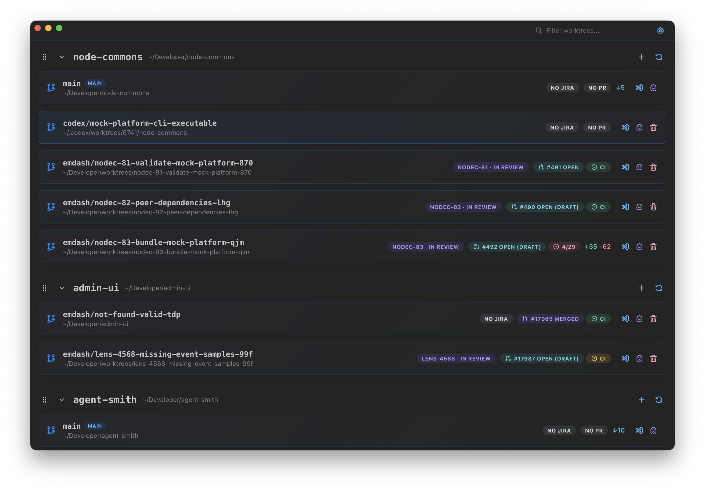

# Treebeard

[](https://github.com/malaporte/treebeard/actions/workflows/build.yml)
[](https://github.com/malaporte/treebeard/actions/workflows/build.yml)

Treebeard is a macOS desktop app for managing Git worktrees across repositories.



## Features

- Manage worktrees across multiple repositories from one dashboard
- Search and filter worktrees by branch or path
- Drag and drop repository sections to reorder them
- Show Jira issue badges parsed from branch names
- Show GitHub PR status and CI check status per branch
- Show dirty status (`+/-` lines, unpushed, unpulled commits)
- Open worktrees in VS Code or Ghostty with one click
- Create and delete worktrees directly from the app
- Built-in auto-update support for packaged releases

## Prerequisites

### To use the packaged app

- macOS
- Git

### Optional (feature-dependent)

- [GitHub CLI (`gh`)](https://cli.github.com/) for PR and CI badges
- [Jira CLI (`jira`)](https://github.com/ankitpokhrel/jira-cli) for Jira badges
- VS Code (`code` command available in PATH) for the VS Code launch button
- [Ghostty](https://ghostty.org/) for the terminal launch button

Treebeard works without optional CLIs, but related badges/actions are unavailable.

### To develop Treebeard

- [Bun](https://bun.sh/)

## Getting Started

```bash
bun install
bun run dev
```

The root desktop app uses Bun only. The Expo mobile app under `apps/mobile` remains a separate setup for now.

## Scripts

| Command               | Description                                                         |
| --------------------- | ------------------------------------------------------------------- |
| `bun run dev`            | Run Treebeard in development mode                                |
| `bun run build`          | Build a packaged app via Electrobun                              |
| `bun run test`           | Run the Vitest suite once                                        |
| `bun run test:watch`     | Run Vitest in watch mode                                         |
| `bun run test:coverage`  | Run Vitest with V8 coverage output                               |
| `bun run typecheck`      | Run TypeScript type-checking (`tsc --noEmit`)                    |
| `bun run start:packaged` | Open the packaged app from `build/stable-macos-arm64/Treebeard.app` |
| `bun run screenshot`     | Launch packaged app and capture `treebeard-current.png`          |

`bun run screenshot` auto-captures the Treebeard window when Accessibility permissions are available, and falls back to manual window selection when they are not.

## Architecture

Treebeard is built with [Electrobun](https://github.com/blackboardsh/electrobun):

- Bun-powered main process (`src/bun/`)
- React renderer in the main view (`src/mainview/`, `src/components/`, `src/hooks/`)
- Typed RPC between renderer and main process (`src/shared/rpc-types.ts`)
- Shared app/domain types in `src/shared/types.ts`

High-level structure:

```text
src/
  bun/         # main process + services (git, github, jira, launcher, config)
  mainview/    # renderer entrypoint and view shell
  components/  # UI components
  hooks/       # renderer data hooks
  shared/      # shared types and RPC schema
```

## Configuration

App settings are persisted at:

`~/.config/treebeard`

This file stores repository paths, polling interval, update settings, and collapsed repo state.

## Contributing

See [CONTRIBUTING.md](CONTRIBUTING.md) for development setup, coding guidelines, and pull request expectations.

## License

[MIT](LICENSE)
