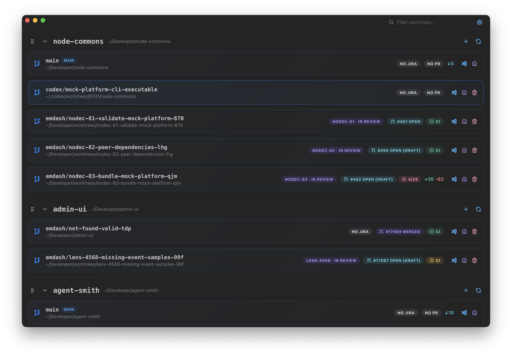

# Treebeard

[](https://github.com/malaporte/treebeard/actions/workflows/build.yml)
[](https://github.com/malaporte/treebeard/actions/workflows/build.yml)

Treebeard is a macOS desktop app for managing Git worktrees across repositories, with Jira issue badges, GitHub PR/CI status, and quick-launch actions for VS Code and Ghostty.



## Why Treebeard?

[Git worktrees](https://git-scm.com/docs/git-worktree) let you check out multiple branches of the same repo simultaneously, each in its own directory. No more stashing, no more switching — just `cd` into the branch you want to work on. If you haven't tried them, they're a game-changer for working on more than one thing at a time.

With AI coding agents (Copilot, Cursor, Claude Code, etc.) the number of things in flight at once has gone up dramatically. You might have an agent working on a feature in one worktree while you review a PR in another and fix a bug in a third. Worktrees make this possible; Treebeard makes it manageable — giving you a single dashboard to see what's happening across all your repos and branches, with PR status, CI checks, and Jira context at a glance.

## Features

### Multi-repo worktree dashboard

All your repos in one place, each as a collapsible section showing every worktree as a card. Search and filter across everything by branch name or path. Drag and drop repo sections to put your most active work at the top — the order is persisted across sessions.

### GitHub and Jira integration

Treebeard shows a PR badge on every branch — state, draft status, and CI check results (pass/fail/pending) — all pulled from the GitHub CLI. Jira issue keys are automatically extracted from branch names (e.g. `feat/PROJ-123-add-login`), and displayed as color-coded badges with the issue status. Click any badge to open the PR or issue in your browser.

### Worktree lifecycle

Create new worktrees from the app — either a new branch or an existing remote branch — with auto-generated paths. Delete worktrees with safety checks that warn you about uncommitted changes or unpushed commits before anything is removed. Every card shows a live dirty-status indicator: lines added/deleted, commits ahead/behind.

### Quick-launch actions

Open any worktree in VS Code or Ghostty with a single click (or double-click a card to open it in VS Code). Jira and GitHub links open in your default browser.

### Auto-updates and settings

Built-in auto-update checks for new releases on a configurable schedule. The settings modal lets you manage your repo list, set the polling interval, and check the health of optional CLI dependencies (`gh` and `jira`).

## Prerequisites

### To use the packaged app

- macOS
- Git

### Optional (feature-dependent)

- [GitHub CLI (`gh`)](https://cli.github.com/) for PR and CI badges
- [Jira CLI (`jira`)](https://github.com/ankitpokhrel/jira-cli) for Jira badges
- VS Code (`code` command available in PATH) for the VS Code launch button
- [Ghostty](https://ghostty.org/) for the terminal launch button

Treebeard works without optional CLIs, but related badges/actions are unavailable.

### To develop Treebeard

- [Bun](https://bun.sh/)

## Getting Started

```bash
bun install
bun run dev
```

## Scripts

| Command               | Description                                                         |
| --------------------- | ------------------------------------------------------------------- |
| `bun run dev`            | Run Treebeard in development mode                                |
| `bun run build`          | Build a packaged app via Electrobun                              |
| `bun run test`           | Run the Vitest suite once                                        |
| `bun run test:watch`     | Run Vitest in watch mode                                         |
| `bun run test:coverage`  | Run Vitest with V8 coverage output                               |
| `bun run typecheck`      | Run TypeScript type-checking (`tsc --noEmit`)                    |
| `bun run start:packaged` | Open the packaged app from `build/stable-macos-arm64/Treebeard.app` |
| `bun run screenshot`     | Launch packaged app and capture `treebeard-current.png`          |

`bun run screenshot` auto-captures the Treebeard window when Accessibility permissions are available, and falls back to manual window selection when they are not.

## Architecture

Treebeard is built with [Electrobun](https://github.com/blackboardsh/electrobun):

- Bun-powered main process (`src/bun/`)
- React renderer in the main view (`src/mainview/`, `src/components/`, `src/hooks/`)
- Typed RPC between renderer and main process (`src/shared/rpc-types.ts`)
- Shared app/domain types in `src/shared/types.ts`
- Local config and dependency checks in the Bun process

High-level structure:

```text
src/
  bun/         # main process + services (git, github, jira, launcher, config)
  mainview/    # renderer entrypoint and view shell
  components/  # UI components
  hooks/       # renderer data hooks
  shared/      # shared types and RPC schema
```

## Configuration

App settings are persisted at:

`~/.config/treebeard/treebeard-config.json`

This file stores repository paths, polling interval, update settings, and collapsed repo state.

## Contributing

See [CONTRIBUTING.md](CONTRIBUTING.md) for development setup, coding guidelines, and pull request expectations.

## License

[MIT](LICENSE)
